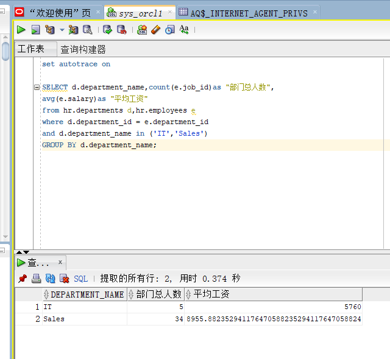
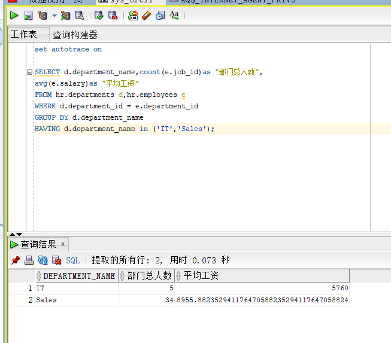
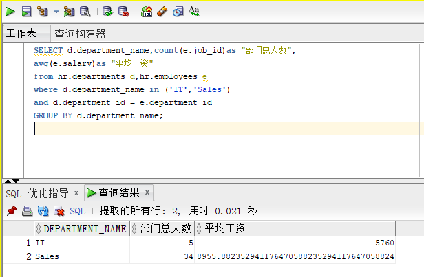
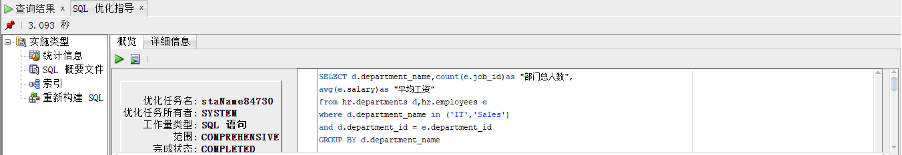

# 实验一
### 姓名：刘世霖   学号：201810414212   班级：软件工程二班
## 实验目的
分析SQL执行计划，执行SQL语句的优化指导。理解分析SQL语句的执行计划的重要作用。
## 实验内容
对Oracle12c中的HR人力资源管理系统中的表进行查询与分析。
首先运行和分析教材中的样例：本训练任务目的是查询两个部门('IT'和'Sales')的部门总人数和平均工资，以下两个查询的结果是一样的。但效率不相同。
设计自己的查询语句，并作相应的分析，查询语句不能太简单。
### 查询一：

### 查询二:

### 结论：
虽然从结果上看，语句2的效率要更优，但是该实验数据量小，查询用时受网速的影响较大。从理论分析上来讲，语句1的效率要高于语句2。因为HAVING 只会在检索出所有记录之后才对结果集进行过滤。这个处理需要排序,总计等操作。如果能通过WHERE子句限制记录的数目，就能减少排序，总计的开销。
### 我设计的查询语句：

### 解释：
先执行d.department_name in ('IT','Sales')的话，不满足条件的结果会被直接筛除，不会在去执行d.department_id = e.department_id这一步，从而节省了时间。
