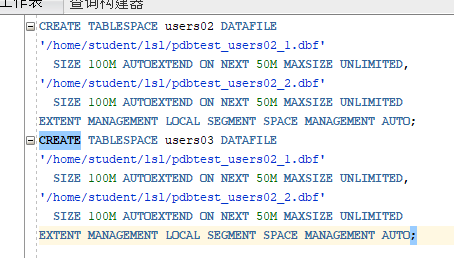
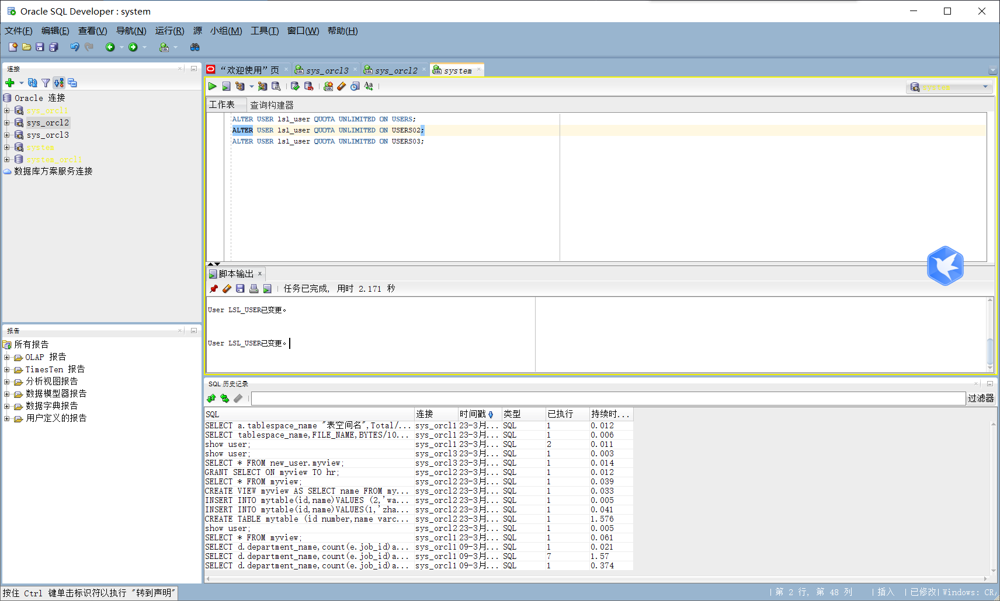
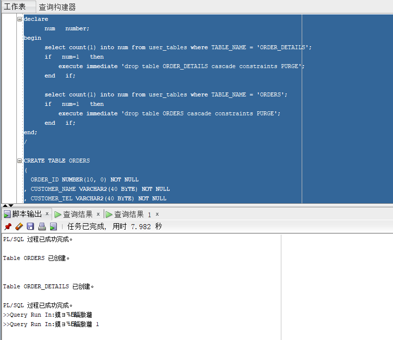
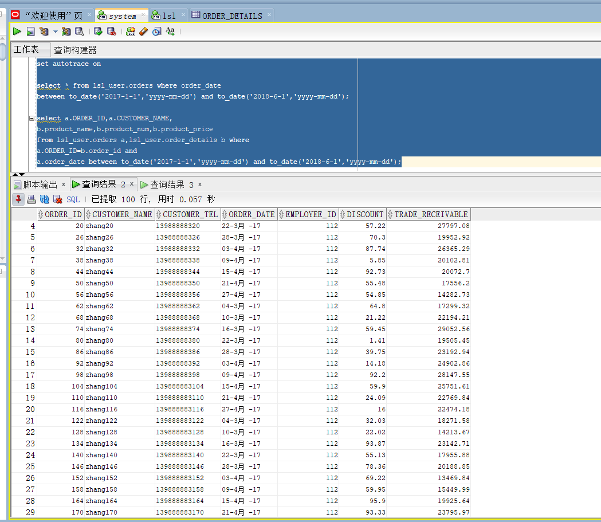
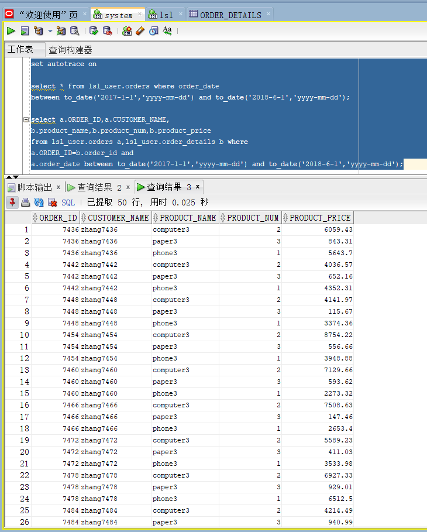
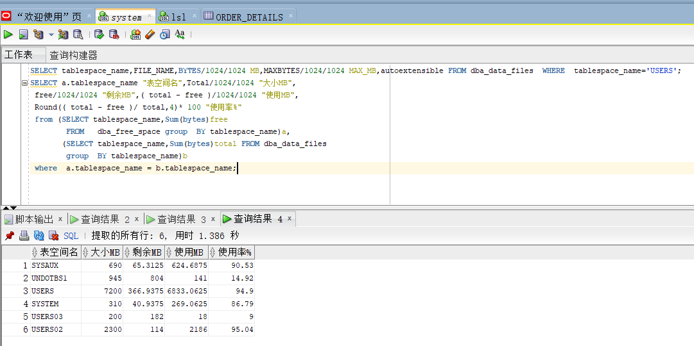

# 实验3：创建分区表 
### 姓名：刘世霖   学号：201810414212   班级：软件工程二班
## 实验目的
掌握分区表的创建方法，掌握各种分区方式的使用场景。
## 实验内容
•本实验使用3个表空间：USERS,USERS02,USERS03。在表空间中创建两张表：订单表(orders)与订单详表(order_details)。

•使用你自己的账号创建本实验的表，表创建在上述3个分区，自定义分区策略。

•你需要使用system用户给你自己的账号分配上述分区的使用权限。你需要使用system用户给你的用户分配可以查询执行计划的权限。

•表创建成功后，插入数据，数据能并平均分布到各个分区。每个表的数据都应该大于1万行，对表进行联合查询。

•写出插入数据的语句和查询数据的语句，并分析语句的执行计划。

•进行分区与不分区的对比实验。
## 实验步骤
•建立USER02和USER03两个表空间。

•关联账号与表空间。

•创建order表和order_detail表，划分区间，并分别插入10000条和30000条数据。

### 查看数据库的使用情况
