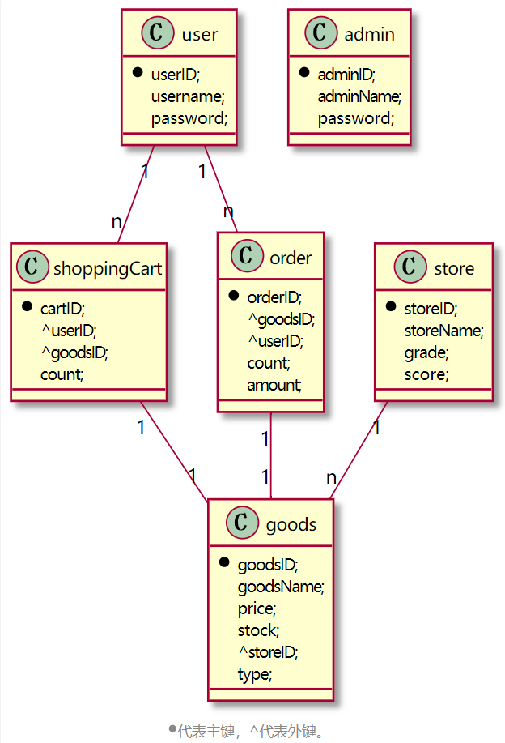

## 一、 引言
1999年底，随着互联网高潮来临。中国网络购物的用户规模不断上升。2010年中国网络购物市场延续用户规模、交易规模的双增长态势。2010年中国网络购物市场交易规模接近5000亿，达4980.0亿元，占到社会消费品零售总额的3.2%；同时，网络购物用户规模达到1.48亿，在网民中的渗透率达30.8%（《2013-2017中国网络购物行业市场前瞻与投资预测分析报告》统计数据显示）。对于一些传统企业而言，通过一些传统的营销手段已经很难对现今的市场形成什么重大的改变了。如果想将企业的销售渠道完全打开，企业就必需引进新的思维和新的方法。而网络购物正好为现今的传统企业提供了一个很好的机会与平台，传统企业通过借助第三方平台和建立自有平台纷纷试水网络购物，构建合理的网络购物平台、整合渠道、完善产业布局成为传统企业未来发展重心和出路。
## 二、 E-R图设计


其中：
·user代表用户表
·admin代表系统管理员表·shoppingCart代表购物车表：
cartID代表该条购物车的id，userID代表加入该条购物车的用户的id，goodsID代表该条购物车的商品ID，count代表该条购物车的商品的数量。
·order代表订单表，goodsID和userID分别代表
商品号和用户号，count代表商品数量，amount代表订单总金额。一个订单只包含一种商品。
·store代表商家表，storename代表店铺名称，grade代表店铺等级，score代表店铺的综合评分（评价）。

·goods代表商品表，其中goodsname代表商品名称，price代表商品单价，stock代表商品库存，storeID代表该商品所属商家的id号，type代表该商品的类型。
## 三、创建表空间、角色和用户
创建两个表空间
```
Create Tablespace space01
 datafile
 '/home/oracle/space01_1.dbf'
  SIZE 100M AUTOEXTEND ON NEXT 256M MAXSIZE UNLIMITED,
 '/home/oracle/space02_2.dbf'
  SIZE 100M AUTOEXTEND ON NEXT 256M MAXSIZE UNLIMITED
 EXTENT MANAGEMENT LOCAL SEGMENT SPACE MANAGEMENT AUTO;

Create Tablespace space02
 datafile
 '/home/oracle/space02_1.dbf'
  SIZE 100M AUTOEXTEND ON NEXT 256M MAXSIZE UNLIMITED,
 '/home/oracle/space02_2.dbf'
  SIZE 100M AUTOEXTEND ON NEXT 256M MAXSIZE UNLIMITED
 EXTENT MANAGEMENT LOCAL SEGMENT SPACE MANAGEMENT AUTO; 

```
创建角色role1和role2，创建用户user1和user2，分配表空间和权限。
```
CREATE ROLE role1;
 GRANT connect,resource,CREATE VIEW TO role1;
 CREATE USER user1 IDENTIFIED BY 123456 DEFAULT TABLESPACE space01 TEMPORARY TABLESPACE temp;
 ALTER USER user1 QUOTA 60M ON space01;
 GRANT role1 TO user1;

CREATE ROLE role2;
GRANT connect,resource TO role2;
CREATE USER user2 IDENTIFIED BY 123456 DEFAULT TABLESPACE space01 TEMPORARY TABLESPACE temp;
ALTER USER user2 QUOTA 60M ON space01;
GRANT role2 TO user2;
```

## 四、创建表
检查表是否已存在，如果存在则删除表。
```
declare

   num  number;

begin
   select count(1) into num from user_tables where TABLE_NAME = 'USER';
   if  num=1  then
      execute immediate 'drop table RUBBISH cascade constraints PURGE';
   end  if;   
  
   select count(1) into num from user_tables where TABLE_NAME = 'ADMIN';
   if  num=1  then
      execute immediate 'drop table MESSAGE cascade constraints PURGE';
   end  if;
  
   select count(1) into num from user_tables where TABLE_NAME = 'SHOPPINGCART';
   if  num=1  then
      execute immediate 'drop table MESSAGE_USER cascade constraints PURGE';
   end  if;

   select count(1) into num from user_tables where TABLE_NAME = 'ORDER';
   if  num=1  then
      execute immediate 'drop table ORDER cascade constraints PURGE';
   end  if;

   select count(1) into num from user_tables where TABLE_NAME = 'STORE';
   if  num=1  then
     execute immediate 'drop table USER cascade constraints PURGE';
   end  if;  
     select count(1) into num from user_tables where TABLE_NAME = 'GOODS';
   if  num=1  then
      execute immediate 'drop table ORDER_INFOR cascade constraints PURGE';
   end  if;  
end;
/
```
创建各个表
```
--创建USER 表
create table user 

(

  userID      INTEGER    primary key ,

  username    VARCHAR2(50)     not null,

  password    VARCHAR2(50)     not null,

);


-- 创建admin表

create table admin 

(

  adminID      INTEGER       primary key,

 adminName     VARCHAR2(50)     not null,

 password       VARCHAR2(50)     not null,

);
 

--创建shoppingCart表

create table shoppingCart 

(

  cartID     INTEGER     primary key,

  userID    INTEGER          not null,

  goodsID      INTEGER         not null,

  count       INTEGER     not null,
);

 
alter table shoppingCart add  foreign key (userID) references user (userID);
alter table shoppingCart add  foreign key (goodsID) references goods (goodsID);

--创建order表

create table order 

(

  ORDERID       INTEGER       not null,

  goodsID      INTEGER  not null,

  userID     INTEGER  not null,

  count      INTEGER  not null,

  amount      DEMICAL        not null

);

 

alter table order add  foreign key (userID) references user (userID);
alter table order add  foreign key (goodsID) references goods (goodsID);

--创建表store

CREATE TABLE STORE(

  storeID INTEGER primary key,

  storeName VARCHAR2(255) NOT NULL,

  grade INTEGER NOT NULL,

  score INTEGER NOT NULL ,

);

-- 创建表goods

create table goods 

(

 goodsID   INTEGER primary key ,

 storeID INTEGER not null,

 goodsName  VARCHAR2(255)    not null,

  price   VARCHAR2(255)     not null,

stock VARCHAR(255) not null;

type VARCHAR(255) not null;

);

 

alter table storeID add  foreign key (storeID) references store (storeID);
```
## 五、插入数据
添加user数据
```
/* 开启输出 */
set SERVEROUTPUT ON;

/* 创建随机数函数,返回一个1到n之间的随机数 */
create or replace function RANDOM(n INTEGER=5)

  return number 

  is 

​    a number ; 

  begin

​    select round(dbms_random.value(1,n)) into a  from dual;

​    return a ;

  end;

  /

 
/* 声明数组 */
DECLARE

  type user_name is varray(5) of varchar2(50);

  type user_password is varray(5) of VARCHAR2(50);
 

  indexRandom NUMBER;

  user_name_list user_name:=user_name('zhangsan','lisi',wanger','mazi','dapao'); 

  user_password_list user_password:=user_password('123456','123','123123','654321','Zxcvbnm123.'); 

/* 插入数据 */
 BEGIN

  dbms_output.put_line(indexRandom);

  for i in 1..20000

  loop

​    indexRandom:=RANDOM();

​    INSERT INTO USER VALUES (i, user_name_list(indexRandom), user_password_list(indexRandom));

  end loop;

 END;

 /
 ```

 添加admin数据
 ```
/* 声明数组 */
DECLARE

  type admin_name is varray(5) of varchar2(50);

  type admin_password is varray(5) of VARCHAR2(50);
 

  indexRandom NUMBER;

  admin_name_list admin_name:=admin_name('zhangsan','lisi',wanger','mazi','dapao'); 

  admin_password_list admin_password:=admin_password('123456','123','123123','654321','Zxcvbnm123.'); 

/* 插入数据 */
 BEGIN

  dbms_output.put_line(indexRandom);

  for i in 1..20000

  loop

​    indexRandom:=RANDOM();

​    INSERT INTO admin VALUES (i, admin_name_list(indexRandom), admin_password_list(indexRandom));

  end loop;

 END;

 /
 ```

 添加shoppingCart数据
 ```
DECLARE
/* 插入数据 */
 BEGIN

  for i in 1..20000

  loop

​    INSERT INTO admin VALUES (i, RANDOM(20000), RANDOM(20000),RANDOM(1000));

  end loop;

 END;
 /
 ```
 添加order数据
 ```
DECLARE
 /* 插入数据,为了方便，amount金额字段全部插入的整数 */
 BEGIN

  for i in 1..20000

  loop

​    INSERT INTO admin VALUES (i, RANDOM(20000), RANDOM(20000),RANDOM(1000),RANDOM(2000));

  end loop;

 END;

 /
 ```

 添加store数据
 ```
DECLARE
 /* 声明数组 */
 type store_name is varray(5) of VARCHAR2(50);

 indexRandom NUMBER;

  store_name_list store_name:=store_name('xxx衣服店','xxx日常生活用品商店','xxx零食店铺','xxx杂货店','xxx生鲜店'); 

 /* 插入数据 */
 BEGIN

  for i in 1..20000

  loop

​    INSERT INTO admin VALUES (i,store_name_list(indexRandom),RANDOM(50),RANDOM(10));

  end loop;

 END;

 /
```

## 六、PL/SQL设计

存储过程1：传入用户id，查询该用户购物车里的所有商品名称

```
set serveroutput on;

 
create or replace procedure queryCart

(

  user_id in USER.userID%type,

  _goodsname out GOODS.goodsID%type

)

as

begin
 
  select g.goodsname into _goodsname from shoppingcart s,goods g where user_id=s.userID and s.goodID=g.goodID;

  dbms_output.put_line(_goodsname);

exceptions

  when no_data_found then

​    dbms_output.put_line('no data found error');

​    when others then

​    dbms_output.put_line('one other error');

end queryCart;

/
```

```
declare

 a GOODS.goodsID%type;
 
BEGIN

  queryCart('1',a);

end;
```

存储过程2：传入用户id，查询该用户所有的订单id

```
set serveroutput on;

 
create or replace procedure queryOrder

(

  user_id in USER.userID%type,

  order_id out ORDER.orderID%type

)

as

begin
 
  select orderID into order_id from order where userID=user_id;

  dbms_output.put_line(order_id);

exception

  when no_data_found then

​    dbms_output.put_line('no data found error');

​    when others then

​    dbms_output.put_line('one other error');

end queryOrder;

/
```

```
declare

 a ORDER.orderID%type;
 
BEGIN

  queryOrder('1',a);

end;
```

存储过程3：传入商家id，查询该商家所有的商品id

```
set serveroutput on;

 
create or replace procedure queryGoods

(

  store_id in STORE.storeID%type,

  goods_id out GOODS.goodsID%type

)

as

begin
 
  select goodsID into goods_id from store where store_id=storeID;

  dbms_output.put_line(goods_id);

exception

  when no_data_found then

​    dbms_output.put_line('no data found error');

​    when others then

​    dbms_output.put_line('one other error');

end queryGoods;

/
```

```
declare

 a GOODS.goodsID%type;
 
BEGIN

  queryGoods('1',a);

end;
```

## 七、备份设计

1.编写rman 增量备份脚本

```

#rman_level1.sh 

#!/bin/sh

export NLS_LANG='SIMPLIFIED CHINESE_CHINA.AL32UTF8'

export ORACLE_HOME=/home/oracle/app/oracle/product/12.1.0/dbhome_1 

export ORACLE_SID=orcl 

export PATH=$ORACLE_HOME/bin:$PATH 

rman target / nocatalog msglog=/home/oracle/rman_backup/lv1_`date +%Y%m%d-%H%M%S`_L0.log << EOF

run{

configure retention policy to redundancy 1;

configure controlfile autobackup on; 

configure controlfile autobackup format for device type disk to '/home/oracle/rman_backup/%F';

configure default device type to disk;

crosscheck backup;

crosscheck archivelog all;

allocate channel c1 device type disk;

backup as compressed backupset incremental level 1 database format '/home/oracle/rman_backup/dblv1_%d_%T_%U.bak'

  plus archivelog format '/home/oracle/rman_backup/arclv1_%d_%T_%U.bak'; 

report obsolete;

delete noprompt obsolete;

delete noprompt expired backup; 

delete noprompt expired archivelog all;
 
release channel c1;
 
}

EOF
 
Exit

```

2.开启全备份

```

[oracle@oracle-pc ~]$ cat rman_level0.sh

[oracle@oracle-pc ~]$ ./rman_level0.sh

```

3.每天定时开始增量备份

```

[oracle@oracle-pc ~]$ cat rman_level1.sh

[oracle@oracle-pc ~]$ ./rman_level1.sh

```

4.备份后修改数据

```

oracle@oracle-pc ~]$ sqlplus study/123@pdborcl 

SQL> create table t1 (id number,name varchar2(50)); 

SQL> insert into t1 values(1,'zhang');1 row created. 

SQL> commit;
 
SQL> select * from t1;

SQL> exit

```

​5.删除数据库，模仿数据库被损坏

```

[oracle@oracle-pc~]$rm /home/oracle/app/oracle/oradata/orcl/pdborcl/SAMPLE_SCHEMA_users01.dbf

```

6.修改

```

oracle@oracle-pc ~]$ sqlplus study/123@pdborcl

SQL> insert into t1 values(2,'wang');

SQL> commit;

SQL> select * from t1;

SQL> declare

n number;
 begin

  for n in 1..10000 loop
  insert into t1 values(n,'name'||n);
  end loop;
  end;
 
SQL> select * from t1;

SQL> exit

```

7.数据库启动到mount状态

```

oracle@oracle-pc ~]$ sqlplus / as sysdba

SQL> shutdown immediate

SQL> shutdown abort

SQL> startup mount

SQL> exit

```

8.开始恢复数据库

```

oracle@oracle-pc ~]$ rman target /

RMAN> restore database ;

RMAN> recover database;

RMAN> alter database open;

Statement processed

RMAN> exit

```

9.查看数据库是否恢复

```

oracle@oracle-pc ~]$ sqlplus study/123@pdborcl

SQL> select * from t9;

```
